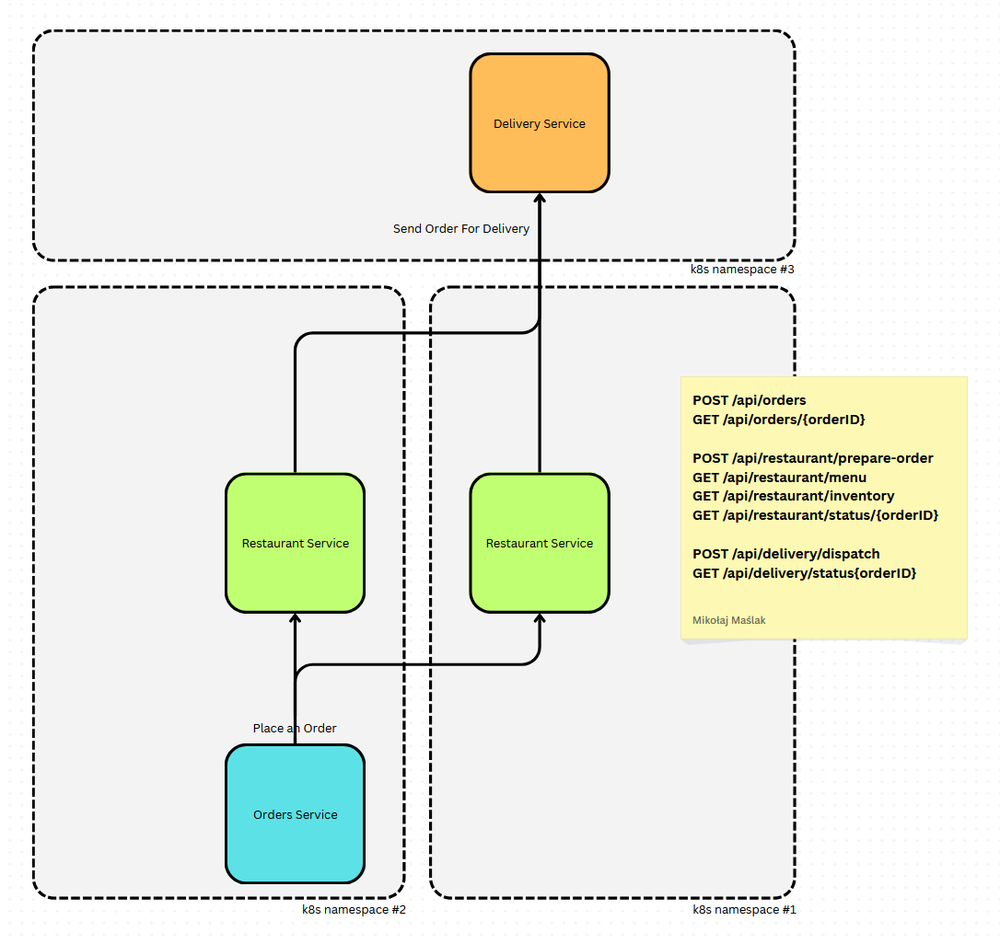

# NS Mesh Microservices Demo

This project demonstrates a simple food delivery system using three microservices:
- Restaurant Service
- Orders Service
- Delivery Service

## Architecture



The services are designed to run in separate Kubernetes namespaces and communicate through NS Mesh (Network Service Mesh).

### Services

#### Restaurant Service
- Manages menu and inventory
- Handles food preparation
- Endpoints:
  - POST /api/restaurant/prepare-order
  - GET /api/restaurant/menu
  - GET /api/restaurant/inventory
  - GET /api/restaurant/status/{orderID}

#### Orders Service
- Manages order creation and tracking
- Endpoints:
  - POST /api/orders
  - GET /api/orders/{orderID}

#### Delivery Service
- Handles order delivery
- Endpoints:
  - POST /api/delivery/dispatch
  - GET /api/delivery/status/{orderID}

## Setup

1. Install dependencies:
```bash
npm install
```

2. Start all services locally:
```bash
npm run start
```

## Kubernetes Deployment

Create microservice images 
```bash
docker build -f services/Dockerfile -t delivery-service:latest ./services/delivery

docker build -f services/Dockerfile -t restaurant-service:latest ./services/restaurant

docker build -f services/Dockerfile -t orders-service:latest ./services/orders
```

Kubernetes TODO